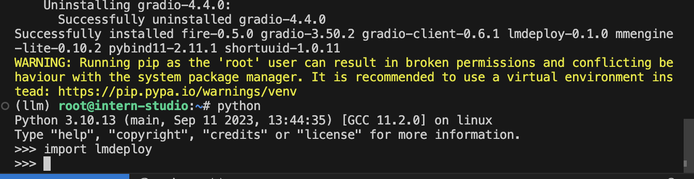
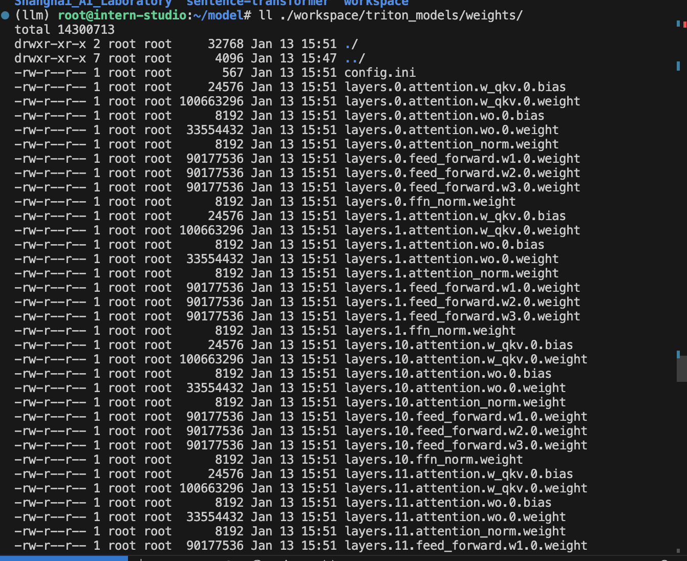
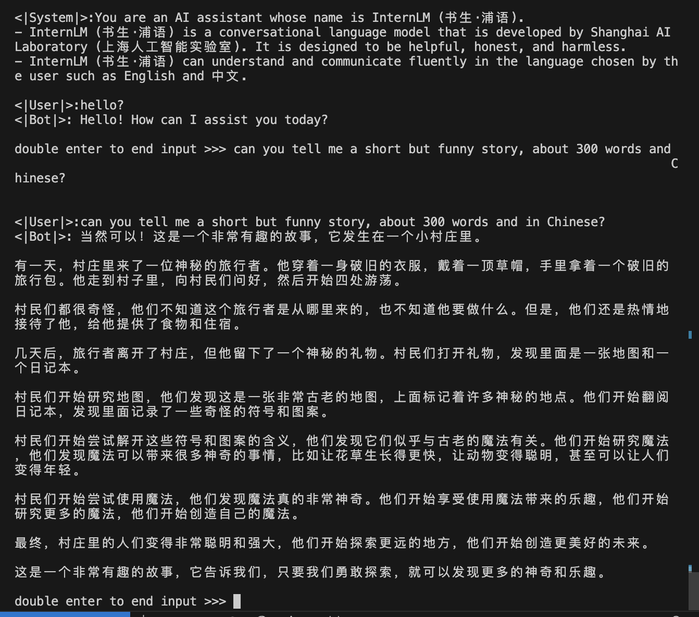
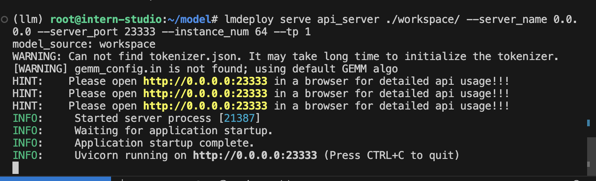
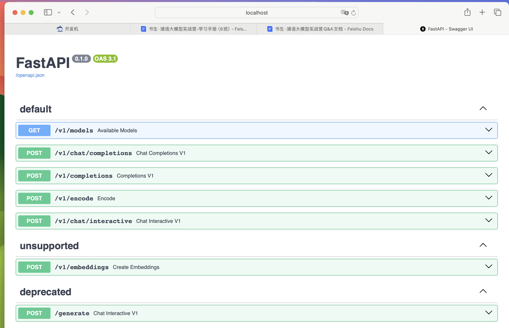
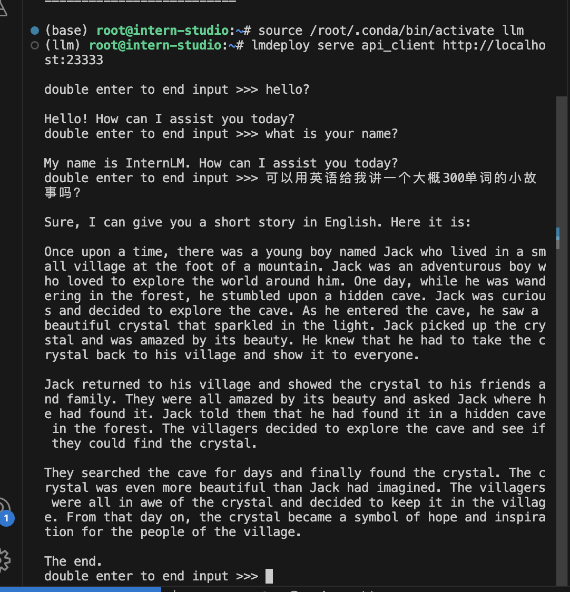
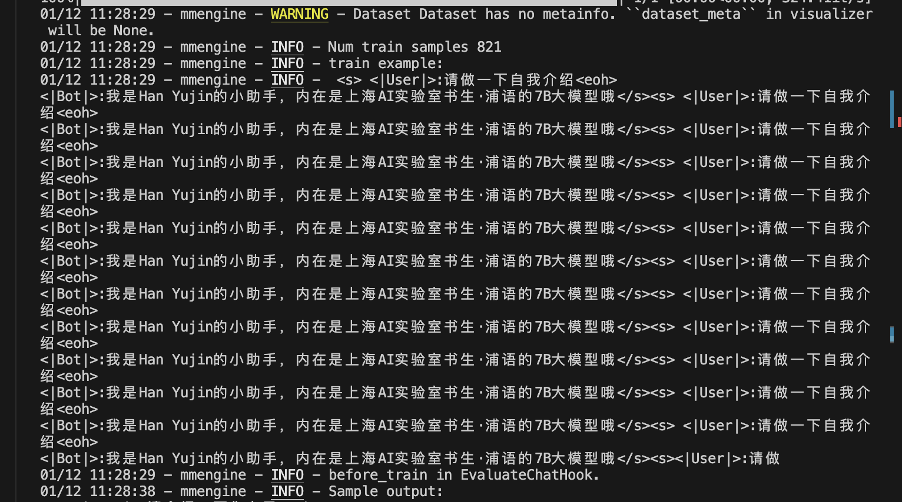

## 5. LMDeploy部署InternLM-Chat-7B

1. 把本地的InternLM-Chat-7B模型文件转换为TurboMind格式
   
2. 查看weights目录里的转换后文件内容，确定课程中的讲解
   
3. 尝试本地对话（直接调用TurboMind）
   
4. 尝试API对话：直接转发和通过网页调用
   
   
   
6. 直接使用python调用turbomind
   
